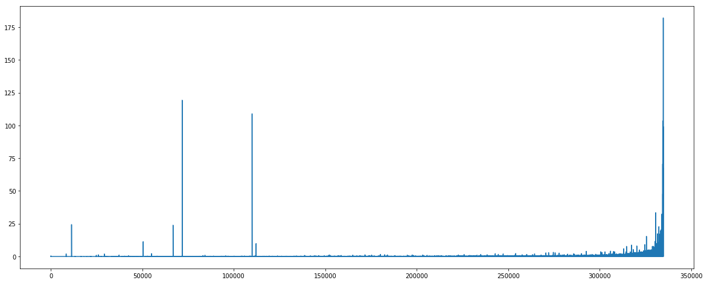

<h1>Table of Contents<span class="tocSkip"></span></h1>
<div class="toc"><ul class="toc-item"></ul></div>


```python
from fastai.io import *
from fastai.structured import *
from sklearn.ensemble import RandomForestRegressor, RandomForestClassifier
from pandas_summary import DataFrameSummary
from IPython.display import display
from sklearn import metrics
import feather
import lightgbm as lgb
from sklearn.model_selection import StratifiedKFold, KFold
from sklearn.metrics import mean_squared_error
import warnings
import gc
from sklearn.linear_model import Ridge
```


```python
merchants = pd.read_csv('data/elo/merchants.csv')
```


```python
merchants.head().T
```


<div>
<style scoped>
    .dataframe tbody tr th:only-of-type {
        vertical-align: middle;
    }

    .dataframe tbody tr th {
        vertical-align: top;
    }

    .dataframe thead th {
        text-align: right;
    }
</style>
<table border="1" class="dataframe">
  <thead>
    <tr style="text-align: right;">
      <th></th>
      <th>0</th>
      <th>1</th>
      <th>2</th>
      <th>3</th>
      <th>4</th>
    </tr>
  </thead>
  <tbody>
    <tr>
      <th>merchant_id</th>
      <td>M_ID_838061e48c</td>
      <td>M_ID_9339d880ad</td>
      <td>M_ID_e726bbae1e</td>
      <td>M_ID_a70e9c5f81</td>
      <td>M_ID_64456c37ce</td>
    </tr>
    <tr>
      <th>merchant_group_id</th>
      <td>8353</td>
      <td>3184</td>
      <td>447</td>
      <td>5026</td>
      <td>2228</td>
    </tr>
    <tr>
      <th>merchant_category_id</th>
      <td>792</td>
      <td>840</td>
      <td>690</td>
      <td>792</td>
      <td>222</td>
    </tr>
    <tr>
      <th>subsector_id</th>
      <td>9</td>
      <td>20</td>
      <td>1</td>
      <td>9</td>
      <td>21</td>
    </tr>
    <tr>
      <th>numerical_1</th>
      <td>-0.0574706</td>
      <td>-0.0574706</td>
      <td>-0.0574706</td>
      <td>-0.0574706</td>
      <td>-0.0574706</td>
    </tr>
    <tr>
      <th>numerical_2</th>
      <td>-0.0574706</td>
      <td>-0.0574706</td>
      <td>-0.0574706</td>
      <td>-0.0574706</td>
      <td>-0.0574706</td>
    </tr>
    <tr>
      <th>category_1</th>
      <td>N</td>
      <td>N</td>
      <td>N</td>
      <td>Y</td>
      <td>Y</td>
    </tr>
    <tr>
      <th>most_recent_sales_range</th>
      <td>E</td>
      <td>E</td>
      <td>E</td>
      <td>E</td>
      <td>E</td>
    </tr>
    <tr>
      <th>most_recent_purchases_range</th>
      <td>E</td>
      <td>E</td>
      <td>E</td>
      <td>E</td>
      <td>E</td>
    </tr>
    <tr>
      <th>avg_sales_lag3</th>
      <td>-0.4</td>
      <td>-0.72</td>
      <td>-82.13</td>
      <td>NaN</td>
      <td>NaN</td>
    </tr>
    <tr>
      <th>avg_purchases_lag3</th>
      <td>9.66667</td>
      <td>1.75</td>
      <td>260</td>
      <td>1.66667</td>
      <td>0.5</td>
    </tr>
    <tr>
      <th>active_months_lag3</th>
      <td>3</td>
      <td>3</td>
      <td>2</td>
      <td>3</td>
      <td>3</td>
    </tr>
    <tr>
      <th>avg_sales_lag6</th>
      <td>-2.25</td>
      <td>-0.74</td>
      <td>-82.13</td>
      <td>NaN</td>
      <td>NaN</td>
    </tr>
    <tr>
      <th>avg_purchases_lag6</th>
      <td>18.6667</td>
      <td>1.29167</td>
      <td>260</td>
      <td>4.66667</td>
      <td>0.361111</td>
    </tr>
    <tr>
      <th>active_months_lag6</th>
      <td>6</td>
      <td>6</td>
      <td>2</td>
      <td>6</td>
      <td>6</td>
    </tr>
    <tr>
      <th>avg_sales_lag12</th>
      <td>-2.32</td>
      <td>-0.57</td>
      <td>-82.13</td>
      <td>NaN</td>
      <td>NaN</td>
    </tr>
    <tr>
      <th>avg_purchases_lag12</th>
      <td>13.9167</td>
      <td>1.6875</td>
      <td>260</td>
      <td>3.83333</td>
      <td>0.347222</td>
    </tr>
    <tr>
      <th>active_months_lag12</th>
      <td>12</td>
      <td>12</td>
      <td>2</td>
      <td>12</td>
      <td>12</td>
    </tr>
    <tr>
      <th>category_4</th>
      <td>N</td>
      <td>N</td>
      <td>N</td>
      <td>Y</td>
      <td>Y</td>
    </tr>
    <tr>
      <th>city_id</th>
      <td>242</td>
      <td>22</td>
      <td>-1</td>
      <td>-1</td>
      <td>-1</td>
    </tr>
    <tr>
      <th>state_id</th>
      <td>9</td>
      <td>16</td>
      <td>5</td>
      <td>-1</td>
      <td>-1</td>
    </tr>
    <tr>
      <th>category_2</th>
      <td>1</td>
      <td>1</td>
      <td>5</td>
      <td>NaN</td>
      <td>NaN</td>
    </tr>
  </tbody>
</table>
</div>


Let's have a look at the dataset summary


```python
DataFrameSummary(merchants).summary().T
```


<div>
<style scoped>
    .dataframe tbody tr th:only-of-type {
        vertical-align: middle;
    }

    .dataframe tbody tr th {
        vertical-align: top;
    }

    .dataframe thead th {
        text-align: right;
    }
</style>
<table border="1" class="dataframe">
  <thead>
    <tr style="text-align: right;">
      <th></th>
      <th>count</th>
      <th>mean</th>
      <th>std</th>
      <th>min</th>
      <th>25%</th>
      <th>50%</th>
      <th>75%</th>
      <th>max</th>
      <th>counts</th>
      <th>uniques</th>
      <th>missing</th>
      <th>missing_perc</th>
      <th>types</th>
    </tr>
  </thead>
  <tbody>
    <tr>
      <th>merchant_id</th>
      <td>NaN</td>
      <td>NaN</td>
      <td>NaN</td>
      <td>NaN</td>
      <td>NaN</td>
      <td>NaN</td>
      <td>NaN</td>
      <td>NaN</td>
      <td>334696</td>
      <td>334633</td>
      <td>0</td>
      <td>0%</td>
      <td>categorical</td>
    </tr>
    <tr>
      <th>merchant_group_id</th>
      <td>334696</td>
      <td>31028.7</td>
      <td>31623</td>
      <td>1</td>
      <td>3612</td>
      <td>19900</td>
      <td>51707.2</td>
      <td>112586</td>
      <td>334696</td>
      <td>109391</td>
      <td>0</td>
      <td>0%</td>
      <td>numeric</td>
    </tr>
    <tr>
      <th>merchant_category_id</th>
      <td>334696</td>
      <td>423.132</td>
      <td>252.898</td>
      <td>-1</td>
      <td>222</td>
      <td>373</td>
      <td>683</td>
      <td>891</td>
      <td>334696</td>
      <td>324</td>
      <td>0</td>
      <td>0%</td>
      <td>numeric</td>
    </tr>
    <tr>
      <th>subsector_id</th>
      <td>334696</td>
      <td>25.1164</td>
      <td>9.80737</td>
      <td>-1</td>
      <td>19</td>
      <td>27</td>
      <td>33</td>
      <td>41</td>
      <td>334696</td>
      <td>41</td>
      <td>0</td>
      <td>0%</td>
      <td>numeric</td>
    </tr>
    <tr>
      <th>numerical_1</th>
      <td>334696</td>
      <td>0.0114764</td>
      <td>1.09815</td>
      <td>-0.0574706</td>
      <td>-0.0574706</td>
      <td>-0.0574706</td>
      <td>-0.0475558</td>
      <td>183.735</td>
      <td>334696</td>
      <td>954</td>
      <td>0</td>
      <td>0%</td>
      <td>numeric</td>
    </tr>
    <tr>
      <th>numerical_2</th>
      <td>334696</td>
      <td>0.00810311</td>
      <td>1.0705</td>
      <td>-0.0574706</td>
      <td>-0.0574706</td>
      <td>-0.0574706</td>
      <td>-0.0475558</td>
      <td>182.079</td>
      <td>334696</td>
      <td>947</td>
      <td>0</td>
      <td>0%</td>
      <td>numeric</td>
    </tr>
    <tr>
      <th>category_1</th>
      <td>NaN</td>
      <td>NaN</td>
      <td>NaN</td>
      <td>NaN</td>
      <td>NaN</td>
      <td>NaN</td>
      <td>NaN</td>
      <td>NaN</td>
      <td>334696</td>
      <td>2</td>
      <td>0</td>
      <td>0%</td>
      <td>bool</td>
    </tr>
    <tr>
      <th>most_recent_sales_range</th>
      <td>NaN</td>
      <td>NaN</td>
      <td>NaN</td>
      <td>NaN</td>
      <td>NaN</td>
      <td>NaN</td>
      <td>NaN</td>
      <td>NaN</td>
      <td>334696</td>
      <td>5</td>
      <td>0</td>
      <td>0%</td>
      <td>categorical</td>
    </tr>
    <tr>
      <th>most_recent_purchases_range</th>
      <td>NaN</td>
      <td>NaN</td>
      <td>NaN</td>
      <td>NaN</td>
      <td>NaN</td>
      <td>NaN</td>
      <td>NaN</td>
      <td>NaN</td>
      <td>334696</td>
      <td>5</td>
      <td>0</td>
      <td>0%</td>
      <td>categorical</td>
    </tr>
    <tr>
      <th>avg_sales_lag3</th>
      <td>334683</td>
      <td>13.833</td>
      <td>2395.49</td>
      <td>-82.13</td>
      <td>0.88</td>
      <td>1</td>
      <td>1.16</td>
      <td>851845</td>
      <td>334683</td>
      <td>3372</td>
      <td>13</td>
      <td>0.00%</td>
      <td>numeric</td>
    </tr>
    <tr>
      <th>avg_purchases_lag3</th>
      <td>334696</td>
      <td>inf</td>
      <td>NaN</td>
      <td>0.333495</td>
      <td>0.92365</td>
      <td>1.01667</td>
      <td>1.14652</td>
      <td>inf</td>
      <td>334696</td>
      <td>100003</td>
      <td>0</td>
      <td>0%</td>
      <td>numeric</td>
    </tr>
    <tr>
      <th>active_months_lag3</th>
      <td>334696</td>
      <td>2.99411</td>
      <td>0.0952475</td>
      <td>1</td>
      <td>3</td>
      <td>3</td>
      <td>3</td>
      <td>3</td>
      <td>334696</td>
      <td>3</td>
      <td>0</td>
      <td>0%</td>
      <td>numeric</td>
    </tr>
    <tr>
      <th>avg_sales_lag6</th>
      <td>334683</td>
      <td>21.6508</td>
      <td>3947.11</td>
      <td>-82.13</td>
      <td>0.85</td>
      <td>1.01</td>
      <td>1.23</td>
      <td>1.51396e+06</td>
      <td>334683</td>
      <td>4507</td>
      <td>13</td>
      <td>0.00%</td>
      <td>numeric</td>
    </tr>
    <tr>
      <th>avg_purchases_lag6</th>
      <td>334696</td>
      <td>inf</td>
      <td>NaN</td>
      <td>0.167045</td>
      <td>0.902247</td>
      <td>1.02696</td>
      <td>1.21558</td>
      <td>inf</td>
      <td>334696</td>
      <td>135202</td>
      <td>0</td>
      <td>0%</td>
      <td>numeric</td>
    </tr>
    <tr>
      <th>active_months_lag6</th>
      <td>334696</td>
      <td>5.9474</td>
      <td>0.394936</td>
      <td>1</td>
      <td>6</td>
      <td>6</td>
      <td>6</td>
      <td>6</td>
      <td>334696</td>
      <td>6</td>
      <td>0</td>
      <td>0%</td>
      <td>numeric</td>
    </tr>
    <tr>
      <th>avg_sales_lag12</th>
      <td>334683</td>
      <td>25.2277</td>
      <td>5251.84</td>
      <td>-82.13</td>
      <td>0.85</td>
      <td>1.02</td>
      <td>1.29</td>
      <td>2.56741e+06</td>
      <td>334683</td>
      <td>5009</td>
      <td>13</td>
      <td>0.00%</td>
      <td>numeric</td>
    </tr>
    <tr>
      <th>avg_purchases_lag12</th>
      <td>334696</td>
      <td>inf</td>
      <td>NaN</td>
      <td>0.0983295</td>
      <td>0.898333</td>
      <td>1.04336</td>
      <td>1.26648</td>
      <td>inf</td>
      <td>334696</td>
      <td>172917</td>
      <td>0</td>
      <td>0%</td>
      <td>numeric</td>
    </tr>
    <tr>
      <th>active_months_lag12</th>
      <td>334696</td>
      <td>11.5993</td>
      <td>1.52014</td>
      <td>1</td>
      <td>12</td>
      <td>12</td>
      <td>12</td>
      <td>12</td>
      <td>334696</td>
      <td>12</td>
      <td>0</td>
      <td>0%</td>
      <td>numeric</td>
    </tr>
    <tr>
      <th>category_4</th>
      <td>NaN</td>
      <td>NaN</td>
      <td>NaN</td>
      <td>NaN</td>
      <td>NaN</td>
      <td>NaN</td>
      <td>NaN</td>
      <td>NaN</td>
      <td>334696</td>
      <td>2</td>
      <td>0</td>
      <td>0%</td>
      <td>bool</td>
    </tr>
    <tr>
      <th>city_id</th>
      <td>334696</td>
      <td>102.918</td>
      <td>107.091</td>
      <td>-1</td>
      <td>-1</td>
      <td>69</td>
      <td>182</td>
      <td>347</td>
      <td>334696</td>
      <td>271</td>
      <td>0</td>
      <td>0%</td>
      <td>numeric</td>
    </tr>
    <tr>
      <th>state_id</th>
      <td>334696</td>
      <td>11.8609</td>
      <td>6.17689</td>
      <td>-1</td>
      <td>9</td>
      <td>9</td>
      <td>16</td>
      <td>24</td>
      <td>334696</td>
      <td>25</td>
      <td>0</td>
      <td>0%</td>
      <td>numeric</td>
    </tr>
    <tr>
      <th>category_2</th>
      <td>322809</td>
      <td>2.38</td>
      <td>1.56266</td>
      <td>1</td>
      <td>1</td>
      <td>2</td>
      <td>4</td>
      <td>5</td>
      <td>322809</td>
      <td>5</td>
      <td>11887</td>
      <td>3.55%</td>
      <td>numeric</td>
    </tr>
  </tbody>
</table>
</div>


 We see that we have 334696 rows but only 334633 merchants. Maybe some of them are duplicated. Let's drop duplicates and check again.


```python
merchant_details_cols = ['merchant_id', 'merchant_group_id', 'merchant_category_id', 'subsector_id', 'category_1', 
                        'category_4', 'city_id', 'state_id', 'category_2']
merchant_details = merchants[merchant_details_cols]

# Delete duplicates
merchant_details = merchant_details.drop_duplicates()
```


```python
DataFrameSummary(merchant_details).summary().T
```


<div>
<style scoped>
    .dataframe tbody tr th:only-of-type {
        vertical-align: middle;
    }

    .dataframe tbody tr th {
        vertical-align: top;
    }

    .dataframe thead th {
        text-align: right;
    }
</style>
<table border="1" class="dataframe">
  <thead>
    <tr style="text-align: right;">
      <th></th>
      <th>count</th>
      <th>mean</th>
      <th>std</th>
      <th>min</th>
      <th>25%</th>
      <th>50%</th>
      <th>75%</th>
      <th>max</th>
      <th>counts</th>
      <th>uniques</th>
      <th>missing</th>
      <th>missing_perc</th>
      <th>types</th>
    </tr>
  </thead>
  <tbody>
    <tr>
      <th>merchant_id</th>
      <td>NaN</td>
      <td>NaN</td>
      <td>NaN</td>
      <td>NaN</td>
      <td>NaN</td>
      <td>NaN</td>
      <td>NaN</td>
      <td>NaN</td>
      <td>334645</td>
      <td>334633</td>
      <td>0</td>
      <td>0%</td>
      <td>categorical</td>
    </tr>
    <tr>
      <th>merchant_group_id</th>
      <td>334645</td>
      <td>31032.5</td>
      <td>31623.2</td>
      <td>1</td>
      <td>3625</td>
      <td>19908</td>
      <td>51716</td>
      <td>112586</td>
      <td>334645</td>
      <td>109391</td>
      <td>0</td>
      <td>0%</td>
      <td>numeric</td>
    </tr>
    <tr>
      <th>merchant_category_id</th>
      <td>334645</td>
      <td>423.123</td>
      <td>252.905</td>
      <td>-1</td>
      <td>222</td>
      <td>373</td>
      <td>683</td>
      <td>891</td>
      <td>334645</td>
      <td>324</td>
      <td>0</td>
      <td>0%</td>
      <td>numeric</td>
    </tr>
    <tr>
      <th>subsector_id</th>
      <td>334645</td>
      <td>25.1171</td>
      <td>9.80706</td>
      <td>-1</td>
      <td>19</td>
      <td>27</td>
      <td>33</td>
      <td>41</td>
      <td>334645</td>
      <td>41</td>
      <td>0</td>
      <td>0%</td>
      <td>numeric</td>
    </tr>
    <tr>
      <th>category_1</th>
      <td>NaN</td>
      <td>NaN</td>
      <td>NaN</td>
      <td>NaN</td>
      <td>NaN</td>
      <td>NaN</td>
      <td>NaN</td>
      <td>NaN</td>
      <td>334645</td>
      <td>2</td>
      <td>0</td>
      <td>0%</td>
      <td>bool</td>
    </tr>
    <tr>
      <th>category_4</th>
      <td>NaN</td>
      <td>NaN</td>
      <td>NaN</td>
      <td>NaN</td>
      <td>NaN</td>
      <td>NaN</td>
      <td>NaN</td>
      <td>NaN</td>
      <td>334645</td>
      <td>2</td>
      <td>0</td>
      <td>0%</td>
      <td>bool</td>
    </tr>
    <tr>
      <th>city_id</th>
      <td>334645</td>
      <td>102.925</td>
      <td>107.093</td>
      <td>-1</td>
      <td>-1</td>
      <td>69</td>
      <td>182</td>
      <td>347</td>
      <td>334645</td>
      <td>271</td>
      <td>0</td>
      <td>0%</td>
      <td>numeric</td>
    </tr>
    <tr>
      <th>state_id</th>
      <td>334645</td>
      <td>11.8616</td>
      <td>6.17629</td>
      <td>-1</td>
      <td>9</td>
      <td>9</td>
      <td>16</td>
      <td>24</td>
      <td>334645</td>
      <td>25</td>
      <td>0</td>
      <td>0%</td>
      <td>numeric</td>
    </tr>
    <tr>
      <th>category_2</th>
      <td>322778</td>
      <td>2.38005</td>
      <td>1.56268</td>
      <td>1</td>
      <td>1</td>
      <td>2</td>
      <td>4</td>
      <td>5</td>
      <td>322778</td>
      <td>5</td>
      <td>11867</td>
      <td>3.55%</td>
      <td>numeric</td>
    </tr>
  </tbody>
</table>
</div>


We still see that out of 334645 rows we have only 334633 unique merchant ids. `drop_duplicates` compares values of each and every column before marking them as duplicate. These merchants aren't duplicate after all, they may be sharing a different city, region or feature like franchises etc. Let's dig deeper.


```python
merchant_details.loc[merchant_details['merchant_id'].duplicated()]
```


<div>
<style scoped>
    .dataframe tbody tr th:only-of-type {
        vertical-align: middle;
    }

    .dataframe tbody tr th {
        vertical-align: top;
    }

    .dataframe thead th {
        text-align: right;
    }
</style>
<table border="1" class="dataframe">
  <thead>
    <tr style="text-align: right;">
      <th></th>
      <th>merchant_id</th>
      <th>merchant_group_id</th>
      <th>merchant_category_id</th>
      <th>subsector_id</th>
      <th>category_1</th>
      <th>category_4</th>
      <th>city_id</th>
      <th>state_id</th>
      <th>category_2</th>
    </tr>
  </thead>
  <tbody>
    <tr>
      <th>3393</th>
      <td>M_ID_bd49e37dda</td>
      <td>4170</td>
      <td>692</td>
      <td>21</td>
      <td>N</td>
      <td>N</td>
      <td>51</td>
      <td>16</td>
      <td>1.0</td>
    </tr>
    <tr>
      <th>4182</th>
      <td>M_ID_ef233cff26</td>
      <td>28799</td>
      <td>560</td>
      <td>34</td>
      <td>N</td>
      <td>Y</td>
      <td>69</td>
      <td>9</td>
      <td>1.0</td>
    </tr>
    <tr>
      <th>7585</th>
      <td>M_ID_dbbf07ebf0</td>
      <td>35</td>
      <td>278</td>
      <td>37</td>
      <td>N</td>
      <td>Y</td>
      <td>17</td>
      <td>22</td>
      <td>4.0</td>
    </tr>
    <tr>
      <th>29465</th>
      <td>M_ID_30340088f2</td>
      <td>35</td>
      <td>544</td>
      <td>29</td>
      <td>N</td>
      <td>Y</td>
      <td>69</td>
      <td>9</td>
      <td>1.0</td>
    </tr>
    <tr>
      <th>47804</th>
      <td>M_ID_645a6af169</td>
      <td>19140</td>
      <td>87</td>
      <td>27</td>
      <td>N</td>
      <td>N</td>
      <td>29</td>
      <td>15</td>
      <td>1.0</td>
    </tr>
    <tr>
      <th>166813</th>
      <td>M_ID_ebbdb42da6</td>
      <td>35</td>
      <td>383</td>
      <td>2</td>
      <td>Y</td>
      <td>Y</td>
      <td>-1</td>
      <td>-1</td>
      <td>NaN</td>
    </tr>
    <tr>
      <th>210654</th>
      <td>M_ID_c2b9ac2ea4</td>
      <td>35</td>
      <td>554</td>
      <td>25</td>
      <td>Y</td>
      <td>Y</td>
      <td>-1</td>
      <td>-1</td>
      <td>NaN</td>
    </tr>
    <tr>
      <th>221181</th>
      <td>M_ID_992a180b15</td>
      <td>8568</td>
      <td>554</td>
      <td>25</td>
      <td>N</td>
      <td>Y</td>
      <td>17</td>
      <td>22</td>
      <td>4.0</td>
    </tr>
    <tr>
      <th>228275</th>
      <td>M_ID_d123532c72</td>
      <td>49094</td>
      <td>385</td>
      <td>17</td>
      <td>Y</td>
      <td>Y</td>
      <td>-1</td>
      <td>-1</td>
      <td>NaN</td>
    </tr>
    <tr>
      <th>330958</th>
      <td>M_ID_42697d5d44</td>
      <td>35</td>
      <td>690</td>
      <td>1</td>
      <td>N</td>
      <td>N</td>
      <td>271</td>
      <td>9</td>
      <td>1.0</td>
    </tr>
    <tr>
      <th>333904</th>
      <td>M_ID_6464db3b45</td>
      <td>35</td>
      <td>210</td>
      <td>35</td>
      <td>Y</td>
      <td>Y</td>
      <td>-1</td>
      <td>-1</td>
      <td>NaN</td>
    </tr>
    <tr>
      <th>334071</th>
      <td>M_ID_1802942aaf</td>
      <td>72963</td>
      <td>302</td>
      <td>22</td>
      <td>N</td>
      <td>N</td>
      <td>96</td>
      <td>9</td>
      <td>1.0</td>
    </tr>
  </tbody>
</table>
</div>


Let's fill in the missing values before digging further


```python
merchants['category_2'] = merchants['category_2'].fillna(0).astype(int)
merchants.loc[merchants['city_id'] == -1, 'city_id'] = 0
merchants.loc[merchants['state_id'] == -1, 'state_id'] = 0
```

We will create a unique vector string which is just concatenation of our need to be unique columns. We will not use `merchant_group_id` as it is not present in transactions table.


```python
merchant_address_id = merchants['merchant_id'].map(str)+ '_' + \
    merchants['merchant_category_id'].map(str) + '_'+ \
    merchants['subsector_id'].map(str) + '_'+ \
    merchants['city_id'].map(str) + '_'+ \
    merchants['state_id'].map(str) + '_'+ \
    merchants['category_2'].map(str)
    
merchants['merchant_address_id'] = merchant_address_id
```


```python
# merchants.drop(['merchant_id', 'merchant_category_id', 'subsector_id', 
#                          'city_id', 'state_id', 'category_2'], axis=1, inplace=True)

merchants.head().T
```


<div>
<style scoped>
    .dataframe tbody tr th:only-of-type {
        vertical-align: middle;
    }

    .dataframe tbody tr th {
        vertical-align: top;
    }

    .dataframe thead th {
        text-align: right;
    }
</style>
<table border="1" class="dataframe">
  <thead>
    <tr style="text-align: right;">
      <th></th>
      <th>0</th>
      <th>1</th>
      <th>2</th>
      <th>3</th>
      <th>4</th>
    </tr>
  </thead>
  <tbody>
    <tr>
      <th>merchant_id</th>
      <td>M_ID_838061e48c</td>
      <td>M_ID_9339d880ad</td>
      <td>M_ID_e726bbae1e</td>
      <td>M_ID_a70e9c5f81</td>
      <td>M_ID_64456c37ce</td>
    </tr>
    <tr>
      <th>merchant_group_id</th>
      <td>8353</td>
      <td>3184</td>
      <td>447</td>
      <td>5026</td>
      <td>2228</td>
    </tr>
    <tr>
      <th>merchant_category_id</th>
      <td>792</td>
      <td>840</td>
      <td>690</td>
      <td>792</td>
      <td>222</td>
    </tr>
    <tr>
      <th>subsector_id</th>
      <td>9</td>
      <td>20</td>
      <td>1</td>
      <td>9</td>
      <td>21</td>
    </tr>
    <tr>
      <th>numerical_1</th>
      <td>-0.0574706</td>
      <td>-0.0574706</td>
      <td>-0.0574706</td>
      <td>-0.0574706</td>
      <td>-0.0574706</td>
    </tr>
    <tr>
      <th>numerical_2</th>
      <td>-0.0574706</td>
      <td>-0.0574706</td>
      <td>-0.0574706</td>
      <td>-0.0574706</td>
      <td>-0.0574706</td>
    </tr>
    <tr>
      <th>category_1</th>
      <td>N</td>
      <td>N</td>
      <td>N</td>
      <td>Y</td>
      <td>Y</td>
    </tr>
    <tr>
      <th>most_recent_sales_range</th>
      <td>E</td>
      <td>E</td>
      <td>E</td>
      <td>E</td>
      <td>E</td>
    </tr>
    <tr>
      <th>most_recent_purchases_range</th>
      <td>E</td>
      <td>E</td>
      <td>E</td>
      <td>E</td>
      <td>E</td>
    </tr>
    <tr>
      <th>avg_sales_lag3</th>
      <td>-0.4</td>
      <td>-0.72</td>
      <td>-82.13</td>
      <td>NaN</td>
      <td>NaN</td>
    </tr>
    <tr>
      <th>avg_purchases_lag3</th>
      <td>9.66667</td>
      <td>1.75</td>
      <td>260</td>
      <td>1.66667</td>
      <td>0.5</td>
    </tr>
    <tr>
      <th>active_months_lag3</th>
      <td>3</td>
      <td>3</td>
      <td>2</td>
      <td>3</td>
      <td>3</td>
    </tr>
    <tr>
      <th>avg_sales_lag6</th>
      <td>-2.25</td>
      <td>-0.74</td>
      <td>-82.13</td>
      <td>NaN</td>
      <td>NaN</td>
    </tr>
    <tr>
      <th>avg_purchases_lag6</th>
      <td>18.6667</td>
      <td>1.29167</td>
      <td>260</td>
      <td>4.66667</td>
      <td>0.361111</td>
    </tr>
    <tr>
      <th>active_months_lag6</th>
      <td>6</td>
      <td>6</td>
      <td>2</td>
      <td>6</td>
      <td>6</td>
    </tr>
    <tr>
      <th>avg_sales_lag12</th>
      <td>-2.32</td>
      <td>-0.57</td>
      <td>-82.13</td>
      <td>NaN</td>
      <td>NaN</td>
    </tr>
    <tr>
      <th>avg_purchases_lag12</th>
      <td>13.9167</td>
      <td>1.6875</td>
      <td>260</td>
      <td>3.83333</td>
      <td>0.347222</td>
    </tr>
    <tr>
      <th>active_months_lag12</th>
      <td>12</td>
      <td>12</td>
      <td>2</td>
      <td>12</td>
      <td>12</td>
    </tr>
    <tr>
      <th>category_4</th>
      <td>N</td>
      <td>N</td>
      <td>N</td>
      <td>Y</td>
      <td>Y</td>
    </tr>
    <tr>
      <th>city_id</th>
      <td>242</td>
      <td>22</td>
      <td>-1</td>
      <td>-1</td>
      <td>-1</td>
    </tr>
    <tr>
      <th>state_id</th>
      <td>9</td>
      <td>16</td>
      <td>5</td>
      <td>-1</td>
      <td>-1</td>
    </tr>
    <tr>
      <th>category_2</th>
      <td>1</td>
      <td>1</td>
      <td>5</td>
      <td>NaN</td>
      <td>NaN</td>
    </tr>
    <tr>
      <th>merchant_address_id</th>
      <td>M_ID_838061e48c_792_9_242_9_1.0</td>
      <td>M_ID_9339d880ad_840_20_22_16_1.0</td>
      <td>M_ID_e726bbae1e_690_1_-1_5_5.0</td>
      <td>M_ID_a70e9c5f81_792_9_-1_-1_nan</td>
      <td>M_ID_64456c37ce_222_21_-1_-1_nan</td>
    </tr>
  </tbody>
</table>
</div>


```python
def rating(x):
    if np.isfinite(x) or x < 0:
        x = (1/x) - 1
        
        if x>1:
            r = 1
        elif x <= 1 and x > 0:
            r = 2
        elif x == 0:
            r = 3
        elif x < 0 and x >= -1:
            r = 4
        else:
            r = 5
    else:
        r = 5
    return r
```


```python
merchants['avg_sales_lag3'] = (merchants['avg_sales_lag3'] / merchants['active_months_lag3']) * 3
merchants['avg_purchases_lag3'] = (merchants['avg_purchases_lag3'] / merchants['active_months_lag3']) * 3
merchants['avg_sales_lag6'] = (merchants['avg_sales_lag6'] / merchants['active_months_lag6']) * 6
merchants['avg_purchases_lag6'] = (merchants['avg_purchases_lag6'] / merchants['active_months_lag6']) * 6
merchants['avg_sales_lag12'] = (merchants['avg_sales_lag12'] / merchants['active_months_lag12']) * 12
merchants['avg_purchases_lag12'] = (merchants['avg_purchases_lag12'] / merchants['active_months_lag12']) * 12


merchants['avg_sales_lag3'] = merchants['avg_sales_lag3'].map(rating)
merchants['avg_purchases_lag3'] = merchants['avg_purchases_lag3'].map(rating)

merchants['avg_sales_lag6'] = merchants['avg_sales_lag6'].map(rating)
merchants['avg_purchases_lag6'] = merchants['avg_purchases_lag6'].map(rating)

merchants['avg_sales_lag12'] = merchants['avg_sales_lag12'].map(rating)
merchants['avg_purchases_lag12'] = merchants['avg_purchases_lag12'].map(rating)

merchants = merchants.drop(['active_months_lag3', 'active_months_lag6', 'active_months_lag12'], axis=1)

merchants.head(10)
```


<div>
<style scoped>
    .dataframe tbody tr th:only-of-type {
        vertical-align: middle;
    }

    .dataframe tbody tr th {
        vertical-align: top;
    }

    .dataframe thead th {
        text-align: right;
    }
</style>
<table border="1" class="dataframe">
  <thead>
    <tr style="text-align: right;">
      <th></th>
      <th>merchant_id</th>
      <th>merchant_group_id</th>
      <th>merchant_category_id</th>
      <th>subsector_id</th>
      <th>numerical_1</th>
      <th>numerical_2</th>
      <th>category_1</th>
      <th>most_recent_sales_range</th>
      <th>most_recent_purchases_range</th>
      <th>avg_sales_lag3</th>
      <th>avg_purchases_lag3</th>
      <th>avg_sales_lag6</th>
      <th>avg_purchases_lag6</th>
      <th>avg_sales_lag12</th>
      <th>avg_purchases_lag12</th>
      <th>category_4</th>
      <th>city_id</th>
      <th>state_id</th>
      <th>category_2</th>
      <th>merchant_address_id</th>
    </tr>
  </thead>
  <tbody>
    <tr>
      <th>0</th>
      <td>M_ID_838061e48c</td>
      <td>8353</td>
      <td>792</td>
      <td>9</td>
      <td>-0.057471</td>
      <td>-0.057471</td>
      <td>N</td>
      <td>E</td>
      <td>E</td>
      <td>5</td>
      <td>4</td>
      <td>5</td>
      <td>4</td>
      <td>5</td>
      <td>4</td>
      <td>N</td>
      <td>242</td>
      <td>9</td>
      <td>1</td>
      <td>M_ID_838061e48c_792_9_242_9_1</td>
    </tr>
    <tr>
      <th>1</th>
      <td>M_ID_9339d880ad</td>
      <td>3184</td>
      <td>840</td>
      <td>20</td>
      <td>-0.057471</td>
      <td>-0.057471</td>
      <td>N</td>
      <td>E</td>
      <td>E</td>
      <td>5</td>
      <td>4</td>
      <td>5</td>
      <td>4</td>
      <td>5</td>
      <td>4</td>
      <td>N</td>
      <td>22</td>
      <td>16</td>
      <td>1</td>
      <td>M_ID_9339d880ad_840_20_22_16_1</td>
    </tr>
    <tr>
      <th>2</th>
      <td>M_ID_e726bbae1e</td>
      <td>447</td>
      <td>690</td>
      <td>1</td>
      <td>-0.057471</td>
      <td>-0.057471</td>
      <td>N</td>
      <td>E</td>
      <td>E</td>
      <td>5</td>
      <td>4</td>
      <td>5</td>
      <td>4</td>
      <td>5</td>
      <td>4</td>
      <td>N</td>
      <td>0</td>
      <td>5</td>
      <td>5</td>
      <td>M_ID_e726bbae1e_690_1_0_5_5</td>
    </tr>
    <tr>
      <th>3</th>
      <td>M_ID_a70e9c5f81</td>
      <td>5026</td>
      <td>792</td>
      <td>9</td>
      <td>-0.057471</td>
      <td>-0.057471</td>
      <td>Y</td>
      <td>E</td>
      <td>E</td>
      <td>5</td>
      <td>4</td>
      <td>5</td>
      <td>4</td>
      <td>5</td>
      <td>4</td>
      <td>Y</td>
      <td>0</td>
      <td>0</td>
      <td>0</td>
      <td>M_ID_a70e9c5f81_792_9_0_0_0</td>
    </tr>
    <tr>
      <th>4</th>
      <td>M_ID_64456c37ce</td>
      <td>2228</td>
      <td>222</td>
      <td>21</td>
      <td>-0.057471</td>
      <td>-0.057471</td>
      <td>Y</td>
      <td>E</td>
      <td>E</td>
      <td>5</td>
      <td>2</td>
      <td>5</td>
      <td>1</td>
      <td>5</td>
      <td>1</td>
      <td>Y</td>
      <td>0</td>
      <td>0</td>
      <td>0</td>
      <td>M_ID_64456c37ce_222_21_0_0_0</td>
    </tr>
    <tr>
      <th>5</th>
      <td>M_ID_a0915f62b5</td>
      <td>20201</td>
      <td>87</td>
      <td>27</td>
      <td>-0.057471</td>
      <td>-0.057471</td>
      <td>N</td>
      <td>E</td>
      <td>E</td>
      <td>5</td>
      <td>3</td>
      <td>5</td>
      <td>4</td>
      <td>5</td>
      <td>4</td>
      <td>Y</td>
      <td>160</td>
      <td>21</td>
      <td>5</td>
      <td>M_ID_a0915f62b5_87_27_160_21_5</td>
    </tr>
    <tr>
      <th>6</th>
      <td>M_ID_bfd41933db</td>
      <td>33861</td>
      <td>792</td>
      <td>9</td>
      <td>-0.057471</td>
      <td>-0.057471</td>
      <td>N</td>
      <td>E</td>
      <td>E</td>
      <td>5</td>
      <td>4</td>
      <td>5</td>
      <td>4</td>
      <td>5</td>
      <td>4</td>
      <td>N</td>
      <td>60</td>
      <td>16</td>
      <td>1</td>
      <td>M_ID_bfd41933db_792_9_60_16_1</td>
    </tr>
    <tr>
      <th>7</th>
      <td>M_ID_d8ff08219e</td>
      <td>16430</td>
      <td>529</td>
      <td>20</td>
      <td>-0.057471</td>
      <td>-0.057471</td>
      <td>Y</td>
      <td>E</td>
      <td>E</td>
      <td>5</td>
      <td>3</td>
      <td>5</td>
      <td>4</td>
      <td>5</td>
      <td>4</td>
      <td>Y</td>
      <td>0</td>
      <td>0</td>
      <td>0</td>
      <td>M_ID_d8ff08219e_529_20_0_0_0</td>
    </tr>
    <tr>
      <th>8</th>
      <td>M_ID_c5b389236d</td>
      <td>37179</td>
      <td>813</td>
      <td>29</td>
      <td>-0.057471</td>
      <td>-0.057471</td>
      <td>N</td>
      <td>E</td>
      <td>E</td>
      <td>5</td>
      <td>4</td>
      <td>5</td>
      <td>4</td>
      <td>5</td>
      <td>4</td>
      <td>N</td>
      <td>248</td>
      <td>15</td>
      <td>1</td>
      <td>M_ID_c5b389236d_813_29_248_15_1</td>
    </tr>
    <tr>
      <th>9</th>
      <td>M_ID_d2162ed113</td>
      <td>112122</td>
      <td>81</td>
      <td>29</td>
      <td>-0.057471</td>
      <td>-0.057471</td>
      <td>Y</td>
      <td>E</td>
      <td>E</td>
      <td>5</td>
      <td>4</td>
      <td>5</td>
      <td>4</td>
      <td>5</td>
      <td>4</td>
      <td>Y</td>
      <td>0</td>
      <td>0</td>
      <td>0</td>
      <td>M_ID_d2162ed113_81_29_0_0_0</td>
    </tr>
  </tbody>
</table>
</div>


```python
merchants['sales_incrase_range'] = merchants[['avg_sales_lag3', 'avg_sales_lag6', 'avg_sales_lag12']].mean(axis=1)
merchants['purchase_incrase_range'] = merchants[['avg_purchases_lag3', 'avg_purchases_lag6', 'avg_purchases_lag12']].mean(axis=1)
```


```python
merchants['sales_incrase_range'] = merchants['sales_incrase_range'].round()
merchants['sales_incrase_range'] = merchants['sales_incrase_range'].astype(int)

merchants['purchase_incrase_range'] = merchants['purchase_incrase_range'].round()
merchants['purchase_incrase_range'] = merchants['purchase_incrase_range'].astype(int)

merchants = merchants.drop(['avg_sales_lag3', 'avg_sales_lag6', 'avg_sales_lag12'], axis=1)
merchants = merchants.drop(['avg_purchases_lag3', 'avg_purchases_lag6', 'avg_purchases_lag12'], axis=1)

# Distribution of categories
print(pd.crosstab(merchants["sales_incrase_range"], merchants["most_recent_sales_range"],margins=True))

merchants.head(10)
```

    most_recent_sales_range     A     B      C       D       E     All
    sales_incrase_range                                               
    1                           2    17    325    2752    3255    6351
    2                         301  1569  12327   50037   47129  111363
    3                         188  1159   8271   29922   42642   82182
    4                         514  2292  13152   34764   84062  134784
    5                           0     0      0       0      16      16
    All                      1005  5037  34075  117475  177104  334696


<div>
<style scoped>
    .dataframe tbody tr th:only-of-type {
        vertical-align: middle;
    }

    .dataframe tbody tr th {
        vertical-align: top;
    }

    .dataframe thead th {
        text-align: right;
    }
</style>
<table border="1" class="dataframe">
  <thead>
    <tr style="text-align: right;">
      <th></th>
      <th>merchant_id</th>
      <th>merchant_group_id</th>
      <th>merchant_category_id</th>
      <th>subsector_id</th>
      <th>numerical_1</th>
      <th>numerical_2</th>
      <th>category_1</th>
      <th>most_recent_sales_range</th>
      <th>most_recent_purchases_range</th>
      <th>category_4</th>
      <th>city_id</th>
      <th>state_id</th>
      <th>category_2</th>
      <th>merchant_address_id</th>
      <th>sales_incrase_range</th>
      <th>purchase_incrase_range</th>
    </tr>
  </thead>
  <tbody>
    <tr>
      <th>0</th>
      <td>M_ID_838061e48c</td>
      <td>8353</td>
      <td>792</td>
      <td>9</td>
      <td>-0.057471</td>
      <td>-0.057471</td>
      <td>N</td>
      <td>E</td>
      <td>E</td>
      <td>N</td>
      <td>242</td>
      <td>9</td>
      <td>1</td>
      <td>M_ID_838061e48c_792_9_242_9_1</td>
      <td>5</td>
      <td>4</td>
    </tr>
    <tr>
      <th>1</th>
      <td>M_ID_9339d880ad</td>
      <td>3184</td>
      <td>840</td>
      <td>20</td>
      <td>-0.057471</td>
      <td>-0.057471</td>
      <td>N</td>
      <td>E</td>
      <td>E</td>
      <td>N</td>
      <td>22</td>
      <td>16</td>
      <td>1</td>
      <td>M_ID_9339d880ad_840_20_22_16_1</td>
      <td>5</td>
      <td>4</td>
    </tr>
    <tr>
      <th>2</th>
      <td>M_ID_e726bbae1e</td>
      <td>447</td>
      <td>690</td>
      <td>1</td>
      <td>-0.057471</td>
      <td>-0.057471</td>
      <td>N</td>
      <td>E</td>
      <td>E</td>
      <td>N</td>
      <td>0</td>
      <td>5</td>
      <td>5</td>
      <td>M_ID_e726bbae1e_690_1_0_5_5</td>
      <td>5</td>
      <td>4</td>
    </tr>
    <tr>
      <th>3</th>
      <td>M_ID_a70e9c5f81</td>
      <td>5026</td>
      <td>792</td>
      <td>9</td>
      <td>-0.057471</td>
      <td>-0.057471</td>
      <td>Y</td>
      <td>E</td>
      <td>E</td>
      <td>Y</td>
      <td>0</td>
      <td>0</td>
      <td>0</td>
      <td>M_ID_a70e9c5f81_792_9_0_0_0</td>
      <td>5</td>
      <td>4</td>
    </tr>
    <tr>
      <th>4</th>
      <td>M_ID_64456c37ce</td>
      <td>2228</td>
      <td>222</td>
      <td>21</td>
      <td>-0.057471</td>
      <td>-0.057471</td>
      <td>Y</td>
      <td>E</td>
      <td>E</td>
      <td>Y</td>
      <td>0</td>
      <td>0</td>
      <td>0</td>
      <td>M_ID_64456c37ce_222_21_0_0_0</td>
      <td>5</td>
      <td>1</td>
    </tr>
    <tr>
      <th>5</th>
      <td>M_ID_a0915f62b5</td>
      <td>20201</td>
      <td>87</td>
      <td>27</td>
      <td>-0.057471</td>
      <td>-0.057471</td>
      <td>N</td>
      <td>E</td>
      <td>E</td>
      <td>Y</td>
      <td>160</td>
      <td>21</td>
      <td>5</td>
      <td>M_ID_a0915f62b5_87_27_160_21_5</td>
      <td>5</td>
      <td>4</td>
    </tr>
    <tr>
      <th>6</th>
      <td>M_ID_bfd41933db</td>
      <td>33861</td>
      <td>792</td>
      <td>9</td>
      <td>-0.057471</td>
      <td>-0.057471</td>
      <td>N</td>
      <td>E</td>
      <td>E</td>
      <td>N</td>
      <td>60</td>
      <td>16</td>
      <td>1</td>
      <td>M_ID_bfd41933db_792_9_60_16_1</td>
      <td>5</td>
      <td>4</td>
    </tr>
    <tr>
      <th>7</th>
      <td>M_ID_d8ff08219e</td>
      <td>16430</td>
      <td>529</td>
      <td>20</td>
      <td>-0.057471</td>
      <td>-0.057471</td>
      <td>Y</td>
      <td>E</td>
      <td>E</td>
      <td>Y</td>
      <td>0</td>
      <td>0</td>
      <td>0</td>
      <td>M_ID_d8ff08219e_529_20_0_0_0</td>
      <td>5</td>
      <td>4</td>
    </tr>
    <tr>
      <th>8</th>
      <td>M_ID_c5b389236d</td>
      <td>37179</td>
      <td>813</td>
      <td>29</td>
      <td>-0.057471</td>
      <td>-0.057471</td>
      <td>N</td>
      <td>E</td>
      <td>E</td>
      <td>N</td>
      <td>248</td>
      <td>15</td>
      <td>1</td>
      <td>M_ID_c5b389236d_813_29_248_15_1</td>
      <td>5</td>
      <td>4</td>
    </tr>
    <tr>
      <th>9</th>
      <td>M_ID_d2162ed113</td>
      <td>112122</td>
      <td>81</td>
      <td>29</td>
      <td>-0.057471</td>
      <td>-0.057471</td>
      <td>Y</td>
      <td>E</td>
      <td>E</td>
      <td>Y</td>
      <td>0</td>
      <td>0</td>
      <td>0</td>
      <td>M_ID_d2162ed113_81_29_0_0_0</td>
      <td>5</td>
      <td>4</td>
    </tr>
  </tbody>
</table>
</div>


```python
merchants['numerical_2'].plot.line(figsize=(20,8))

print("Data in histogram bins\n",np.histogram(merchants['numerical_2'])[0])
print("Bins\n",np.histogram(merchants['numerical_2'])[1])

print("Mean:", np.mean(merchants['numerical_2']))
```

    Data in histogram bins
     [334582     70     22      8      3      5      2      1      1      2]
    Bins
     [ -0.05747  18.15621  36.36989  54.58357  72.79725  91.01093 109.22461 127.43828 145.65196 163.86564
     182.07932]
    Mean: 0.008103109673703892





```python
vc_numerical_1 = merchants['numerical_1'].value_counts()
vc_numerical_2 = merchants['numerical_2'].value_counts()
print("Value counts of 'numerical_1`")
vc_numerical_1.head(20)
```

    Value counts of 'numerical_1`


    -0.057471    228788
    -0.047556     41528
    -0.037641     15689
    -0.027726      8297
    -0.017811      5249
    -0.007896      3739
     0.002019      2874
     0.011934      2249
     0.021849      1869
     0.031763      1642
     0.041678      1363
     0.051593      1220
     0.061508      1079
     0.071423       927
     0.081338       866
     0.091253       770
     0.101168       719
     0.111083       619
     0.120998       562
     0.130913       507
    Name: numerical_1, dtype: int64


```python
outliers_numerical_1 = merchants.loc[merchants['numerical_1'] > 20, :]
outliers_numerical_2 = merchants.loc[merchants['numerical_2'] > 20, :]
outliers_numerical_1.head(10)
```


<div>
<style scoped>
    .dataframe tbody tr th:only-of-type {
        vertical-align: middle;
    }

    .dataframe tbody tr th {
        vertical-align: top;
    }

    .dataframe thead th {
        text-align: right;
    }
</style>
<table border="1" class="dataframe">
  <thead>
    <tr style="text-align: right;">
      <th></th>
      <th>merchant_id</th>
      <th>merchant_group_id</th>
      <th>merchant_category_id</th>
      <th>subsector_id</th>
      <th>numerical_1</th>
      <th>numerical_2</th>
      <th>category_1</th>
      <th>most_recent_sales_range</th>
      <th>most_recent_purchases_range</th>
      <th>category_4</th>
      <th>city_id</th>
      <th>state_id</th>
      <th>category_2</th>
      <th>merchant_address_id</th>
      <th>sales_incrase_range</th>
      <th>purchase_incrase_range</th>
    </tr>
  </thead>
  <tbody>
    <tr>
      <th>11364</th>
      <td>M_ID_508ecbdcde</td>
      <td>35</td>
      <td>650</td>
      <td>29</td>
      <td>25.671706</td>
      <td>24.313364</td>
      <td>N</td>
      <td>A</td>
      <td>A</td>
      <td>Y</td>
      <td>158</td>
      <td>15</td>
      <td>1</td>
      <td>M_ID_508ecbdcde_650_29_158_15_1</td>
      <td>4</td>
      <td>4</td>
    </tr>
    <tr>
      <th>66837</th>
      <td>M_ID_26d4fadb60</td>
      <td>35</td>
      <td>80</td>
      <td>37</td>
      <td>24.243960</td>
      <td>23.847364</td>
      <td>N</td>
      <td>A</td>
      <td>A</td>
      <td>Y</td>
      <td>17</td>
      <td>22</td>
      <td>4</td>
      <td>M_ID_26d4fadb60_80_37_17_22_4</td>
      <td>4</td>
      <td>4</td>
    </tr>
    <tr>
      <th>71810</th>
      <td>M_ID_b794b9d9e8</td>
      <td>35</td>
      <td>511</td>
      <td>7</td>
      <td>136.827699</td>
      <td>119.278318</td>
      <td>N</td>
      <td>A</td>
      <td>A</td>
      <td>Y</td>
      <td>69</td>
      <td>9</td>
      <td>1</td>
      <td>M_ID_b794b9d9e8_511_7_69_9_1</td>
      <td>4</td>
      <td>4</td>
    </tr>
    <tr>
      <th>110011</th>
      <td>M_ID_ae9fe1605a</td>
      <td>35</td>
      <td>462</td>
      <td>31</td>
      <td>128.628073</td>
      <td>108.897413</td>
      <td>N</td>
      <td>A</td>
      <td>A</td>
      <td>Y</td>
      <td>69</td>
      <td>9</td>
      <td>1</td>
      <td>M_ID_ae9fe1605a_462_31_69_9_1</td>
      <td>4</td>
      <td>4</td>
    </tr>
    <tr>
      <th>330524</th>
      <td>M_ID_63ece6c9c1</td>
      <td>35</td>
      <td>462</td>
      <td>31</td>
      <td>36.597931</td>
      <td>33.345842</td>
      <td>N</td>
      <td>B</td>
      <td>B</td>
      <td>Y</td>
      <td>158</td>
      <td>15</td>
      <td>1</td>
      <td>M_ID_63ece6c9c1_462_31_158_15_1</td>
      <td>4</td>
      <td>4</td>
    </tr>
    <tr>
      <th>332300</th>
      <td>M_ID_323617d0d5</td>
      <td>35</td>
      <td>511</td>
      <td>7</td>
      <td>23.123576</td>
      <td>22.717065</td>
      <td>Y</td>
      <td>B</td>
      <td>B</td>
      <td>Y</td>
      <td>0</td>
      <td>0</td>
      <td>0</td>
      <td>M_ID_323617d0d5_511_7_0_0_0</td>
      <td>4</td>
      <td>4</td>
    </tr>
    <tr>
      <th>333104</th>
      <td>M_ID_b18d2bae5b</td>
      <td>35</td>
      <td>511</td>
      <td>7</td>
      <td>20.040040</td>
      <td>19.435231</td>
      <td>N</td>
      <td>B</td>
      <td>B</td>
      <td>N</td>
      <td>0</td>
      <td>16</td>
      <td>1</td>
      <td>M_ID_b18d2bae5b_511_7_0_16_1</td>
      <td>4</td>
      <td>4</td>
    </tr>
    <tr>
      <th>333616</th>
      <td>M_ID_83ada27927</td>
      <td>35</td>
      <td>130</td>
      <td>41</td>
      <td>20.555615</td>
      <td>20.506041</td>
      <td>N</td>
      <td>B</td>
      <td>B</td>
      <td>N</td>
      <td>0</td>
      <td>15</td>
      <td>1</td>
      <td>M_ID_83ada27927_130_41_0_15_1</td>
      <td>3</td>
      <td>4</td>
    </tr>
    <tr>
      <th>333857</th>
      <td>M_ID_235fba1cce</td>
      <td>35</td>
      <td>511</td>
      <td>7</td>
      <td>22.746809</td>
      <td>22.032936</td>
      <td>N</td>
      <td>A</td>
      <td>A</td>
      <td>Y</td>
      <td>17</td>
      <td>22</td>
      <td>4</td>
      <td>M_ID_235fba1cce_511_7_17_22_4</td>
      <td>4</td>
      <td>4</td>
    </tr>
    <tr>
      <th>333867</th>
      <td>M_ID_5b9e251eea</td>
      <td>35</td>
      <td>511</td>
      <td>7</td>
      <td>32.136224</td>
      <td>30.569669</td>
      <td>N</td>
      <td>A</td>
      <td>A</td>
      <td>Y</td>
      <td>137</td>
      <td>19</td>
      <td>3</td>
      <td>M_ID_5b9e251eea_511_7_137_19_3</td>
      <td>4</td>
      <td>4</td>
    </tr>
  </tbody>
</table>
</div>


```python
vc_1 = merchants['numerical_1'].value_counts()
vc_1 = vc_1.reset_index()
vc_1 = vc_1.rename(columns={'index':'sales_rating'})
vc_1 = vc_1.sort_values(by='sales_rating', ascending=False)
vc_1 = vc_1.reset_index(drop=True)
vc_1 = vc_1.drop('numerical_1', axis=1)
vc_1 = vc_1.reset_index(drop=False)
vc_1 = vc_1.set_index('sales_rating')
vc_dict_1 = vc_1.to_dict()

vc_2 = merchants['numerical_2'].value_counts()
vc_2 = vc_2.reset_index()
vc_2 = vc_2.rename(columns={'index':'purchase_rating'})
vc_2 = vc_2.sort_values(by='purchase_rating', ascending=False)
vc_2 = vc_2.reset_index(drop=True)
vc_2 = vc_2.drop('numerical_2', axis=1)
vc_2 = vc_2.reset_index(drop=False)
vc_2 = vc_2.set_index('purchase_rating')
vc_dict_2 = vc_2.to_dict()
```


```python
# merchants['numerical_1'] = merchants['numerical_1'].map(vc_dict_1['index'])
# merchants['numerical_2'] = merchants['numerical_2'].map(vc_dict_2['index'])
merchants['numerical_1'] = np.round(merchants['numerical_1'] / 0.009914905 + 5.79639, 0)
merchants['numerical_2'] = np.round(merchants['numerical_2'] / 0.009914905 + 5.79639, 0)

merchants.head(10)
```


<div>
<style scoped>
    .dataframe tbody tr th:only-of-type {
        vertical-align: middle;
    }

    .dataframe tbody tr th {
        vertical-align: top;
    }

    .dataframe thead th {
        text-align: right;
    }
</style>
<table border="1" class="dataframe">
  <thead>
    <tr style="text-align: right;">
      <th></th>
      <th>merchant_id</th>
      <th>merchant_group_id</th>
      <th>merchant_category_id</th>
      <th>subsector_id</th>
      <th>numerical_1</th>
      <th>numerical_2</th>
      <th>category_1</th>
      <th>most_recent_sales_range</th>
      <th>most_recent_purchases_range</th>
      <th>category_4</th>
      <th>city_id</th>
      <th>state_id</th>
      <th>category_2</th>
      <th>merchant_address_id</th>
      <th>sales_incrase_range</th>
      <th>purchase_incrase_range</th>
    </tr>
  </thead>
  <tbody>
    <tr>
      <th>0</th>
      <td>M_ID_838061e48c</td>
      <td>8353</td>
      <td>792</td>
      <td>9</td>
      <td>0.0</td>
      <td>0.0</td>
      <td>N</td>
      <td>E</td>
      <td>E</td>
      <td>N</td>
      <td>242</td>
      <td>9</td>
      <td>1</td>
      <td>M_ID_838061e48c_792_9_242_9_1</td>
      <td>5</td>
      <td>4</td>
    </tr>
    <tr>
      <th>1</th>
      <td>M_ID_9339d880ad</td>
      <td>3184</td>
      <td>840</td>
      <td>20</td>
      <td>0.0</td>
      <td>0.0</td>
      <td>N</td>
      <td>E</td>
      <td>E</td>
      <td>N</td>
      <td>22</td>
      <td>16</td>
      <td>1</td>
      <td>M_ID_9339d880ad_840_20_22_16_1</td>
      <td>5</td>
      <td>4</td>
    </tr>
    <tr>
      <th>2</th>
      <td>M_ID_e726bbae1e</td>
      <td>447</td>
      <td>690</td>
      <td>1</td>
      <td>0.0</td>
      <td>0.0</td>
      <td>N</td>
      <td>E</td>
      <td>E</td>
      <td>N</td>
      <td>0</td>
      <td>5</td>
      <td>5</td>
      <td>M_ID_e726bbae1e_690_1_0_5_5</td>
      <td>5</td>
      <td>4</td>
    </tr>
    <tr>
      <th>3</th>
      <td>M_ID_a70e9c5f81</td>
      <td>5026</td>
      <td>792</td>
      <td>9</td>
      <td>0.0</td>
      <td>0.0</td>
      <td>Y</td>
      <td>E</td>
      <td>E</td>
      <td>Y</td>
      <td>0</td>
      <td>0</td>
      <td>0</td>
      <td>M_ID_a70e9c5f81_792_9_0_0_0</td>
      <td>5</td>
      <td>4</td>
    </tr>
    <tr>
      <th>4</th>
      <td>M_ID_64456c37ce</td>
      <td>2228</td>
      <td>222</td>
      <td>21</td>
      <td>0.0</td>
      <td>0.0</td>
      <td>Y</td>
      <td>E</td>
      <td>E</td>
      <td>Y</td>
      <td>0</td>
      <td>0</td>
      <td>0</td>
      <td>M_ID_64456c37ce_222_21_0_0_0</td>
      <td>5</td>
      <td>1</td>
    </tr>
    <tr>
      <th>5</th>
      <td>M_ID_a0915f62b5</td>
      <td>20201</td>
      <td>87</td>
      <td>27</td>
      <td>0.0</td>
      <td>0.0</td>
      <td>N</td>
      <td>E</td>
      <td>E</td>
      <td>Y</td>
      <td>160</td>
      <td>21</td>
      <td>5</td>
      <td>M_ID_a0915f62b5_87_27_160_21_5</td>
      <td>5</td>
      <td>4</td>
    </tr>
    <tr>
      <th>6</th>
      <td>M_ID_bfd41933db</td>
      <td>33861</td>
      <td>792</td>
      <td>9</td>
      <td>0.0</td>
      <td>0.0</td>
      <td>N</td>
      <td>E</td>
      <td>E</td>
      <td>N</td>
      <td>60</td>
      <td>16</td>
      <td>1</td>
      <td>M_ID_bfd41933db_792_9_60_16_1</td>
      <td>5</td>
      <td>4</td>
    </tr>
    <tr>
      <th>7</th>
      <td>M_ID_d8ff08219e</td>
      <td>16430</td>
      <td>529</td>
      <td>20</td>
      <td>0.0</td>
      <td>0.0</td>
      <td>Y</td>
      <td>E</td>
      <td>E</td>
      <td>Y</td>
      <td>0</td>
      <td>0</td>
      <td>0</td>
      <td>M_ID_d8ff08219e_529_20_0_0_0</td>
      <td>5</td>
      <td>4</td>
    </tr>
    <tr>
      <th>8</th>
      <td>M_ID_c5b389236d</td>
      <td>37179</td>
      <td>813</td>
      <td>29</td>
      <td>0.0</td>
      <td>0.0</td>
      <td>N</td>
      <td>E</td>
      <td>E</td>
      <td>N</td>
      <td>248</td>
      <td>15</td>
      <td>1</td>
      <td>M_ID_c5b389236d_813_29_248_15_1</td>
      <td>5</td>
      <td>4</td>
    </tr>
    <tr>
      <th>9</th>
      <td>M_ID_d2162ed113</td>
      <td>112122</td>
      <td>81</td>
      <td>29</td>
      <td>0.0</td>
      <td>0.0</td>
      <td>Y</td>
      <td>E</td>
      <td>E</td>
      <td>Y</td>
      <td>0</td>
      <td>0</td>
      <td>0</td>
      <td>M_ID_d2162ed113_81_29_0_0_0</td>
      <td>5</td>
      <td>4</td>
    </tr>
  </tbody>
</table>
</div>


```python
merchants.groupby('numerical_1')['merchant_id'].count()
```


    numerical_1
    0.0        228788
    1.0         41528
    2.0         15689
    3.0          8297
    4.0          5249
    5.0          3739
    6.0          2874
    7.0          2249
    8.0          1869
    9.0          1642
    10.0         1363
    11.0         1220
    12.0         1079
    13.0          927
    14.0          866
    15.0          770
    16.0          719
    17.0          619
    18.0          562
    19.0          507
    20.0          467
    21.0          444
    22.0          392
    23.0          385
    24.0          316
    25.0          316
    26.0          286
    27.0          293
    28.0          299
    29.0          259
                ...  
    4979.0          1
    4980.0          1
    5061.0          1
    5110.0          1
    5270.0          1
    5416.0          1
    5417.0          1
    5548.0          1
    5738.0          1
    6029.0          1
    6514.0          1
    6551.0          1
    6802.0          1
    7162.0          1
    7502.0          1
    7716.0          1
    8091.0          1
    8278.0          1
    8306.0          1
    10040.0         1
    10534.0         1
    10655.0         1
    10863.0         1
    11890.0         1
    12979.0         1
    13049.0         1
    13806.0         1
    15178.0         1
    17426.0         1
    18537.0         1
    Name: merchant_id, Length: 954, dtype: int64


```python
merchants = merchants.drop(['category_1'], axis=1)
```


```python
merchants['most_recent_sales_range'] = merchants['most_recent_sales_range']\
                                            .map({'A':1, 'B':2, 'C':3, 'D':4, 'E':5})
merchants['most_recent_purchases_range'] = merchants['most_recent_purchases_range']\
                                            .map({'A':1, 'B':2, 'C':3, 'D':4, 'E':5})

```


```python
merchants['recent_activity_range'] = merchants['most_recent_sales_range'] + merchants['most_recent_purchases_range']
merchants['increase_in_activity_range'] = merchants['sales_incrase_range'] + merchants['purchase_incrase_range']
merchants['numerical_range'] = merchants['numerical_1'] + merchants['numerical_2']

```


```python
vc1 = merchants['recent_activity_range'].value_counts()
vc2 = merchants['increase_in_activity_range'].value_counts()
vc1.head(10)
```


    10    141459
    8      74146
    9      67647
    7      24147
    6      19600
    5       3502
    4       2870
    3        701
    2        624
    Name: recent_activity_range, dtype: int64


```python
merchants['merchant_rating'] = merchants['recent_activity_range'] + merchants['increase_in_activity_range']
```


```python
merchants = merchants.drop(['recent_activity_range', 'increase_in_activity_range'], axis=1)
```


```python
merchants = merchants.drop(['most_recent_sales_range', 'most_recent_purchases_range',
                            'sales_incrase_range', 'purchase_incrase_range',
                            'numerical_1', 'numerical_2'], axis=1)

```


```python
u = merchants['merchant_address_id'].value_counts()
print("Number of merchant_id with more than one observations:", len(u[u.values > 1]))
multi_obs_merchant_ids = u[u.values > 1].index 
multi_observ_table_merchants = merchants[merchants['merchant_address_id'].isin(multi_obs_merchant_ids)]
marchant_id_groups_m = multi_observ_table_merchants.groupby('merchant_address_id')

indices_to_drop = []
total = 0
for n in list(marchant_id_groups_m.groups.keys()):
    a_merchant_id_group_m = marchant_id_groups_m.get_group(n)
    size_of_group = a_merchant_id_group_m.shape[0]
    total += size_of_group
    size_after_dropped = size_of_group
    x = [col for col in a_merchant_id_group_m.columns if a_merchant_id_group_m[col].nunique()!=1]
    drop_this = []
    
    if not set(x).isdisjoint(['merchant_rating']): # 'merchant_rating' is different
        id_to_drop = a_merchant_id_group_m[a_merchant_id_group_m['merchant_rating']!=max(a_merchant_id_group_m['merchant_rating'])].index  
        a_merchant_id_group_m = a_merchant_id_group_m.drop(list(id_to_drop), axis=0)
        drop_this = drop_this + list(id_to_drop)
        size_after_dropped = a_merchant_id_group_m.shape[0]
    
    if size_after_dropped > 1 and not set(x).isdisjoint(['numerical_range']):
        id_to_drop = a_merchant_id_group_m[a_merchant_id_group_m['numerical_range']!=max(a_merchant_id_group_m['numerical_range'])].index
        a_merchant_id_group_m = a_merchant_id_group_m.drop(list(id_to_drop), axis=0)
        drop_this = drop_this + list(id_to_drop)
        size_after_dropped = a_merchant_id_group_m.shape[0]
        
    if size_after_dropped > 1 and not set(x).isdisjoint(['merchant_group_id']):
        id_to_drop = a_merchant_id_group_m[a_merchant_id_group_m['merchant_group_id']!=min(a_merchant_id_group_m['merchant_group_id'])].index
        a_merchant_id_group_m = a_merchant_id_group_m.drop(list(id_to_drop), axis=0)
        drop_this = drop_this + list(id_to_drop)
        size_after_dropped = a_merchant_id_group_m.shape[0]
        
    #print("Key=", n, "\tSize=", size_of_group, "\tDrop=", drop_this)
    indices_to_drop = indices_to_drop + drop_this
# end of for loop
a_merchant_id_group_m = marchant_id_groups_m.get_group('M_ID_9b0ef314cf_400_7_231_9_1') 
    
merchants = merchants.drop(indices_to_drop, axis=0)
merchants = merchants.reset_index(drop=True)
    
print("%d observations for %d merchant ids. %d duplicates deleted" %(total, 
                                                                     len(list(marchant_id_groups_m.groups.keys())), 
                                                                     len(indices_to_drop)))
merchants = merchants.drop(['merchant_group_id'], axis=1)

merchants.head(10)
```

    Number of merchant_id with more than one observations: 40
    102 observations for 40 merchant ids. 62 duplicates deleted


<div>
<style scoped>
    .dataframe tbody tr th:only-of-type {
        vertical-align: middle;
    }

    .dataframe tbody tr th {
        vertical-align: top;
    }

    .dataframe thead th {
        text-align: right;
    }
</style>
<table border="1" class="dataframe">
  <thead>
    <tr style="text-align: right;">
      <th></th>
      <th>merchant_id</th>
      <th>merchant_category_id</th>
      <th>subsector_id</th>
      <th>category_4</th>
      <th>city_id</th>
      <th>state_id</th>
      <th>category_2</th>
      <th>merchant_address_id</th>
      <th>numerical_range</th>
      <th>merchant_rating</th>
    </tr>
  </thead>
  <tbody>
    <tr>
      <th>0</th>
      <td>M_ID_838061e48c</td>
      <td>792</td>
      <td>9</td>
      <td>N</td>
      <td>242</td>
      <td>9</td>
      <td>1</td>
      <td>M_ID_838061e48c_792_9_242_9_1</td>
      <td>0.0</td>
      <td>19</td>
    </tr>
    <tr>
      <th>1</th>
      <td>M_ID_9339d880ad</td>
      <td>840</td>
      <td>20</td>
      <td>N</td>
      <td>22</td>
      <td>16</td>
      <td>1</td>
      <td>M_ID_9339d880ad_840_20_22_16_1</td>
      <td>0.0</td>
      <td>19</td>
    </tr>
    <tr>
      <th>2</th>
      <td>M_ID_e726bbae1e</td>
      <td>690</td>
      <td>1</td>
      <td>N</td>
      <td>0</td>
      <td>5</td>
      <td>5</td>
      <td>M_ID_e726bbae1e_690_1_0_5_5</td>
      <td>0.0</td>
      <td>19</td>
    </tr>
    <tr>
      <th>3</th>
      <td>M_ID_a70e9c5f81</td>
      <td>792</td>
      <td>9</td>
      <td>Y</td>
      <td>0</td>
      <td>0</td>
      <td>0</td>
      <td>M_ID_a70e9c5f81_792_9_0_0_0</td>
      <td>0.0</td>
      <td>19</td>
    </tr>
    <tr>
      <th>4</th>
      <td>M_ID_64456c37ce</td>
      <td>222</td>
      <td>21</td>
      <td>Y</td>
      <td>0</td>
      <td>0</td>
      <td>0</td>
      <td>M_ID_64456c37ce_222_21_0_0_0</td>
      <td>0.0</td>
      <td>16</td>
    </tr>
    <tr>
      <th>5</th>
      <td>M_ID_a0915f62b5</td>
      <td>87</td>
      <td>27</td>
      <td>Y</td>
      <td>160</td>
      <td>21</td>
      <td>5</td>
      <td>M_ID_a0915f62b5_87_27_160_21_5</td>
      <td>0.0</td>
      <td>19</td>
    </tr>
    <tr>
      <th>6</th>
      <td>M_ID_bfd41933db</td>
      <td>792</td>
      <td>9</td>
      <td>N</td>
      <td>60</td>
      <td>16</td>
      <td>1</td>
      <td>M_ID_bfd41933db_792_9_60_16_1</td>
      <td>0.0</td>
      <td>19</td>
    </tr>
    <tr>
      <th>7</th>
      <td>M_ID_d8ff08219e</td>
      <td>529</td>
      <td>20</td>
      <td>Y</td>
      <td>0</td>
      <td>0</td>
      <td>0</td>
      <td>M_ID_d8ff08219e_529_20_0_0_0</td>
      <td>0.0</td>
      <td>19</td>
    </tr>
    <tr>
      <th>8</th>
      <td>M_ID_c5b389236d</td>
      <td>813</td>
      <td>29</td>
      <td>N</td>
      <td>248</td>
      <td>15</td>
      <td>1</td>
      <td>M_ID_c5b389236d_813_29_248_15_1</td>
      <td>0.0</td>
      <td>19</td>
    </tr>
    <tr>
      <th>9</th>
      <td>M_ID_d2162ed113</td>
      <td>81</td>
      <td>29</td>
      <td>Y</td>
      <td>0</td>
      <td>0</td>
      <td>0</td>
      <td>M_ID_d2162ed113_81_29_0_0_0</td>
      <td>0.0</td>
      <td>19</td>
    </tr>
  </tbody>
</table>
</div>


```python
merchants.shape
```


    (334634, 10)


```python
merchants.head().T
```


<div>
<style scoped>
    .dataframe tbody tr th:only-of-type {
        vertical-align: middle;
    }

    .dataframe tbody tr th {
        vertical-align: top;
    }

    .dataframe thead th {
        text-align: right;
    }
</style>
<table border="1" class="dataframe">
  <thead>
    <tr style="text-align: right;">
      <th></th>
      <th>0</th>
      <th>1</th>
      <th>2</th>
      <th>3</th>
      <th>4</th>
    </tr>
  </thead>
  <tbody>
    <tr>
      <th>merchant_id</th>
      <td>M_ID_838061e48c</td>
      <td>M_ID_9339d880ad</td>
      <td>M_ID_e726bbae1e</td>
      <td>M_ID_a70e9c5f81</td>
      <td>M_ID_64456c37ce</td>
    </tr>
    <tr>
      <th>merchant_category_id</th>
      <td>792</td>
      <td>840</td>
      <td>690</td>
      <td>792</td>
      <td>222</td>
    </tr>
    <tr>
      <th>subsector_id</th>
      <td>9</td>
      <td>20</td>
      <td>1</td>
      <td>9</td>
      <td>21</td>
    </tr>
    <tr>
      <th>category_4</th>
      <td>N</td>
      <td>N</td>
      <td>N</td>
      <td>Y</td>
      <td>Y</td>
    </tr>
    <tr>
      <th>city_id</th>
      <td>242</td>
      <td>22</td>
      <td>0</td>
      <td>0</td>
      <td>0</td>
    </tr>
    <tr>
      <th>state_id</th>
      <td>9</td>
      <td>16</td>
      <td>5</td>
      <td>0</td>
      <td>0</td>
    </tr>
    <tr>
      <th>category_2</th>
      <td>1</td>
      <td>1</td>
      <td>5</td>
      <td>0</td>
      <td>0</td>
    </tr>
    <tr>
      <th>merchant_address_id</th>
      <td>M_ID_838061e48c_792_9_242_9_1</td>
      <td>M_ID_9339d880ad_840_20_22_16_1</td>
      <td>M_ID_e726bbae1e_690_1_0_5_5</td>
      <td>M_ID_a70e9c5f81_792_9_0_0_0</td>
      <td>M_ID_64456c37ce_222_21_0_0_0</td>
    </tr>
    <tr>
      <th>numerical_range</th>
      <td>0</td>
      <td>0</td>
      <td>0</td>
      <td>0</td>
      <td>0</td>
    </tr>
    <tr>
      <th>merchant_rating</th>
      <td>19</td>
      <td>19</td>
      <td>19</td>
      <td>19</td>
      <td>16</td>
    </tr>
  </tbody>
</table>
</div>


```python
merchants['merchant_rating'].nunique()
```


    16


```python
merchants.columns.values
```


    array(['merchant_id', 'merchant_category_id', 'subsector_id', 'category_4', 'city_id', 'state_id',
           'category_2', 'merchant_address_id', 'numerical_range', 'merchant_rating'], dtype=object)


```python
merchants.drop(['merchant_category_id', 'subsector_id', 'city_id', 'state_id', 'category_2' ], axis=1, inplace=True)
```


```python
merchants.shape
```


    (334634, 5)


```python
merchants['category_4'] = merchants['category_4'].map({'Y':1, 'N':0}) 
```


```python
merchants.head()
```


<div>
<style scoped>
    .dataframe tbody tr th:only-of-type {
        vertical-align: middle;
    }

    .dataframe tbody tr th {
        vertical-align: top;
    }

    .dataframe thead th {
        text-align: right;
    }
</style>
<table border="1" class="dataframe">
  <thead>
    <tr style="text-align: right;">
      <th></th>
      <th>merchant_id</th>
      <th>category_4</th>
      <th>merchant_address_id</th>
      <th>numerical_range</th>
      <th>merchant_rating</th>
    </tr>
  </thead>
  <tbody>
    <tr>
      <th>0</th>
      <td>M_ID_838061e48c</td>
      <td>0</td>
      <td>M_ID_838061e48c_792_9_242_9_1</td>
      <td>0.0</td>
      <td>19</td>
    </tr>
    <tr>
      <th>1</th>
      <td>M_ID_9339d880ad</td>
      <td>0</td>
      <td>M_ID_9339d880ad_840_20_22_16_1</td>
      <td>0.0</td>
      <td>19</td>
    </tr>
    <tr>
      <th>2</th>
      <td>M_ID_e726bbae1e</td>
      <td>0</td>
      <td>M_ID_e726bbae1e_690_1_0_5_5</td>
      <td>0.0</td>
      <td>19</td>
    </tr>
    <tr>
      <th>3</th>
      <td>M_ID_a70e9c5f81</td>
      <td>1</td>
      <td>M_ID_a70e9c5f81_792_9_0_0_0</td>
      <td>0.0</td>
      <td>19</td>
    </tr>
    <tr>
      <th>4</th>
      <td>M_ID_64456c37ce</td>
      <td>1</td>
      <td>M_ID_64456c37ce_222_21_0_0_0</td>
      <td>0.0</td>
      <td>16</td>
    </tr>
  </tbody>
</table>
</div>


```python
merchants.to_feather('merchants_df')
```
